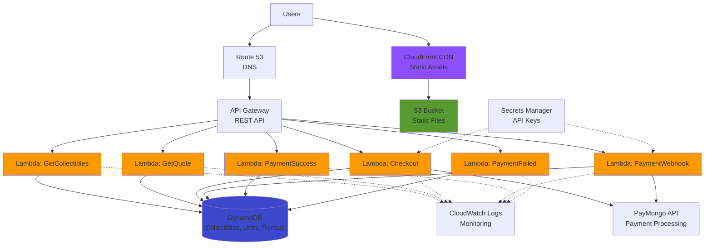

# AWS Serverless Architecture Guide - MongoCollectibles

This guide provides a **fully serverless architecture** for deploying the MongoCollectibles rental system on AWS, offering maximum scalability, minimal operational overhead, and pay-per-use pricing.

---

## 📋 Table of Contents

1. [Serverless Architecture Overview](#serverless-architecture-overview)
2. [Architecture Diagram](#architecture-diagram)
3. [Components Breakdown](#components-breakdown)
4. [Implementation Guide](#implementation-guide)
5. [Code Refactoring for Serverless](#code-refactoring-for-serverless)
6. [Database Design with DynamoDB](#database-design-with-dynamodb)
7. [Deployment with SAM/Serverless Framework](#deployment-with-samserverless-framework)
8. [API Gateway Configuration](#api-gateway-configuration)
9. [Cost Analysis](#cost-analysis)
10. [Pros and Cons](#pros-and-cons)
11. [Migration Strategy](#migration-strategy)

---

## Serverless Architecture Overview

### Key Benefits

- ✅ **Zero server management** - No EC2 instances to maintain
- ✅ **Auto-scaling** - Handles 0 to millions of requests automatically
- ✅ **Pay-per-use** - Only pay for actual execution time
- ✅ **High availability** - Built-in redundancy across multiple AZs
- ✅ **Fast deployment** - Deploy updates in seconds
- ✅ **Cost-effective** - Extremely cheap for low-to-medium traffic

### When to Use Serverless

**Perfect for:**
- Variable or unpredictable traffic patterns
- Event-driven applications
- Microservices architecture
- Startups wanting to minimize infrastructure costs
- Applications with sporadic usage

**Not ideal for:**
- Consistent high-volume traffic (container-based might be cheaper)
- Long-running processes (>15 minutes)
- Applications requiring persistent connections
- Very low-latency requirements (<10ms)

---

## Architecture Diagram



---

## Components Breakdown

### 1. **AWS Lambda** (Compute)
- **Purpose**: Run backend logic without servers
- **Configuration**: Go 1.x runtime, 512MB memory, 30s timeout
- **Functions**: 6 Lambda functions (one per API endpoint)
- **Cold Start**: ~100-300ms for Go (acceptable for most use cases)

### 2. **API Gateway** (API Management)
- **Purpose**: HTTP API endpoint for Lambda functions
- **Type**: REST API with request validation
- **Features**: CORS, rate limiting, API keys, usage plans
- **Cost**: $3.50 per million requests

### 3. **DynamoDB** (Database)
- **Purpose**: NoSQL database for all data storage
- **Mode**: On-demand billing (pay per request)
- **Tables**: Collectibles, CollectibleUnits, Rentals, Warehouses
- **Features**: Auto-scaling, point-in-time recovery, global tables

### 4. **S3 + CloudFront** (Static Hosting)
- **Purpose**: Serve HTML, CSS, JS, images
- **S3**: Storage for static files
- **CloudFront**: Global CDN for fast delivery
- **Features**: HTTPS, custom domain, edge caching

### 5. **Secrets Manager** (Security)
- **Purpose**: Store PayMongo API keys securely
- **Access**: Lambda functions retrieve secrets at runtime
- **Rotation**: Automatic secret rotation support

### 6. **CloudWatch** (Monitoring)
- **Purpose**: Logs, metrics, and alarms
- **Features**: Lambda execution logs, custom metrics, dashboards
- **Retention**: 7-30 days configurable

---

## Implementation Guide

### Phase 1: Setup AWS Infrastructure

#### 1. Create DynamoDB Tables

```bash
# Collectibles Table
aws dynamodb create-table \
  --table-name MongoCollectibles-Collectibles \
  --attribute-definitions \
    AttributeName=id,AttributeType=S \
  --key-schema \
    AttributeName=id,KeyType=HASH \
  --billing-mode PAY_PER_REQUEST \
  --tags Key=Application,Value=MongoCollectibles

# CollectibleUnits Table
aws dynamodb create-table \
  --table-name MongoCollectibles-Units \
  --attribute-definitions \
    AttributeName=id,AttributeType=S \
    AttributeName=collectibleId,AttributeType=S \
    AttributeName=isAvailable,AttributeType=S \
  --key-schema \
    AttributeName=id,KeyType=HASH \
  --global-secondary-indexes \
    "[{\"IndexName\":\"collectibleId-index\",\"KeySchema\":[{\"AttributeName\":\"collectibleId\",\"KeyType\":\"HASH\"},{\"AttributeName\":\"isAvailable\",\"KeyType\":\"RANGE\"}],\"Projection\":{\"ProjectionType\":\"ALL\"}}]" \
  --billing-mode PAY_PER_REQUEST

# Rentals Table
aws dynamodb create-table \
  --table-name MongoCollectibles-Rentals \
  --attribute-definitions \
    AttributeName=id,AttributeType=S \
    AttributeName=paymentId,AttributeType=S \
  --key-schema \
    AttributeName=id,KeyType=HASH \
  --global-secondary-indexes \
    "[{\"IndexName\":\"paymentId-index\",\"KeySchema\":[{\"AttributeName\":\"paymentId\",\"KeyType\":\"HASH\"}],\"Projection\":{\"ProjectionType\":\"ALL\"}}]" \
  --billing-mode PAY_PER_REQUEST

# Warehouses Table
aws dynamodb create-table \
  --table-name MongoCollectibles-Warehouses \
  --attribute-definitions \
    AttributeName=id,AttributeType=S \
  --key-schema \
    AttributeName=id,KeyType=HASH \
  --billing-mode PAY_PER_REQUEST
```

#### 2. Store Secrets in Secrets Manager

```bash
aws secretsmanager create-secret \
  --name mongocollectibles/paymongo \
  --description "PayMongo API credentials" \
  --secret-string '{
    "secretKey": "sk_test_your_secret_key",
    "publicKey": "pk_test_your_public_key"
  }'
```

#### 3. Create S3 Bucket for Static Files

```bash
# Create bucket
aws s3 mb s3://mongocollectibles-static

# Enable static website hosting
aws s3 website s3://mongocollectibles-static \
  --index-document index.html \
  --error-document error.html

# Upload static files
aws s3 sync ./static s3://mongocollectibles-static --acl public-read
```

#### 4. Create CloudFront Distribution

```bash
aws cloudfront create-distribution \
  --origin-domain-name mongocollectibles-static.s3.amazonaws.com \
  --default-root-object index.html
```

---

## Code Refactoring for Serverless

### Lambda Function Structure

Each Lambda function should be a separate handler. Here's the recommended structure:

```
mongocollectibles/
├── cmd/
│   ├── get-collectibles/
│   │   └── main.go
│   ├── get-quote/
│   │   └── main.go
│   ├── checkout/
│   │   └── main.go
│   ├── payment-webhook/
│   │   └── main.go
│   ├── payment-success/
│   │   └── main.go
│   └── payment-failed/
│       └── main.go
├── internal/
│   ├── database/
│   │   └── dynamodb.go
│   ├── models/
│   │   └── models.go
│   ├── services/
│   │   ├── allocation.go
│   │   ├── pricing.go
│   │   └── payment.go
│   └── utils/
│       └── response.go
├── template.yaml (SAM template)
└── go.mod
```

### Example Lambda Function: Get Collectibles

**File: `cmd/get-collectibles/main.go`**

```go
package main

import (
	"context"
	"encoding/json"
	"log"

	"github.com/aws/aws-lambda-go/events"
	"github.com/aws/aws-lambda-go/lambda"
	"github.com/aws/aws-sdk-go-v2/config"
	"github.com/aws/aws-sdk-go-v2/service/dynamodb"
	"github.com/mongocollectibles/rental-system/internal/database"
	"github.com/mongocollectibles/rental-system/internal/utils"
)

type Handler struct {
	db *database.DynamoDBClient
}

func (h *Handler) HandleRequest(ctx context.Context, request events.APIGatewayProxyRequest) (events.APIGatewayProxyResponse, error) {
	log.Println("Getting all collectibles")

	// Get collectibles from DynamoDB
	collectibles, err := h.db.GetAllCollectibles(ctx)
	if err != nil {
		log.Printf("Error getting collectibles: %v", err)
		return utils.ErrorResponse(500, "Failed to retrieve collectibles"), nil
	}

	// Return success response
	return utils.SuccessResponse(200, map[string]interface{}{
		"success": true,
		"data":    collectibles,
	}), nil
}

func main() {
	// Initialize AWS SDK
	cfg, err := config.LoadDefaultConfig(context.Background())
	if err != nil {
		log.Fatal("Failed to load AWS config:", err)
	}

	// Create DynamoDB client
	dynamoClient := dynamodb.NewFromConfig(cfg)
	dbClient := database.NewDynamoDBClient(dynamoClient)

	// Create handler
	handler := &Handler{db: dbClient}

	// Start Lambda
	lambda.Start(handler.HandleRequest)
}
```

### Example Lambda Function: Checkout

**File: `cmd/checkout/main.go`**

```go
package main

import (
	"context"
	"encoding/json"
	"log"
	"os"

	"github.com/aws/aws-lambda-go/events"
	"github.com/aws/aws-lambda-go/lambda"
	"github.com/aws/aws-sdk-go-v2/config"
	"github.com/aws/aws-sdk-go-v2/service/dynamodb"
	"github.com/aws/aws-sdk-go-v2/service/secretsmanager"
	"github.com/google/uuid"
	"github.com/mongocollectibles/rental-system/internal/database"
	"github.com/mongocollectibles/rental-system/internal/models"
	"github.com/mongocollectibles/rental-system/internal/services"
	"github.com/mongocollectibles/rental-system/internal/utils"
)

type Handler struct {
	db             *database.DynamoDBClient
	paymentService *services.PaymentService
	allocationMgr  *services.AllocationManager
	pricingService *services.PricingService
}

type CheckoutRequest struct {
	CollectibleID string              `json:"collectible_id"`
	StoreID       string              `json:"store_id"`
	Duration      int                 `json:"duration"`
	PaymentMethod string              `json:"payment_method"`
	Customer      models.CustomerInfo `json:"customer"`
}

func (h *Handler) HandleRequest(ctx context.Context, request events.APIGatewayProxyRequest) (events.APIGatewayProxyResponse, error) {
	// Parse request body
	var req CheckoutRequest
	if err := json.Unmarshal([]byte(request.Body), &req); err != nil {
		return utils.ErrorResponse(400, "Invalid request body"), nil
	}

	// Get collectible
	collectible, err := h.db.GetCollectibleByID(ctx, req.CollectibleID)
	if err != nil {
		return utils.ErrorResponse(404, "Collectible not found"), nil
	}

	// Allocate warehouse unit
	unit, eta, err := h.allocationMgr.Allocate(ctx, req.CollectibleID, req.StoreID)
	if err != nil {
		return utils.ErrorResponse(409, "No available units"), nil
	}

	// Calculate pricing
	dailyRate, totalFee, _ := h.pricingService.CalculateRentalFee(collectible.Size, req.Duration)

	// Create rental record
	rentalID := uuid.New().String()
	rental := &models.Rental{
		ID:              rentalID,
		CollectibleID:   req.CollectibleID,
		CollectibleName: collectible.Name,
		StoreID:         req.StoreID,
		WarehouseID:     unit.WarehouseID,
		Customer:        req.Customer,
		Duration:        req.Duration,
		DailyRate:       dailyRate,
		TotalFee:        totalFee,
		PaymentMethod:   req.PaymentMethod,
		PaymentStatus:   models.PaymentPending,
		ETA:             eta,
	}

	// Create payment session
	baseURL := os.Getenv("BASE_URL")
	paymentID, paymentURL, err := h.paymentService.CreateCheckoutSession(
		totalFee,
		rentalID,
		collectible.Name,
		req.Duration,
		baseURL,
	)
	if err != nil {
		// Release the unit if payment creation fails
		h.allocationMgr.ReleaseUnit(ctx, req.CollectibleID, unit.WarehouseID)
		return utils.ErrorResponse(500, "Failed to create payment"), nil
	}

	rental.PaymentID = paymentID
	rental.PaymentURL = paymentURL

	// Save rental to DynamoDB
	if err := h.db.CreateRental(ctx, rental); err != nil {
		return utils.ErrorResponse(500, "Failed to create rental"), nil
	}

	// Return response
	return utils.SuccessResponse(200, map[string]interface{}{
		"success": true,
		"data": map[string]interface{}{
			"rental_id":   rentalID,
			"total_fee":   totalFee,
			"eta":         eta,
			"payment_url": paymentURL,
			"message":     "Rental created successfully. Please complete payment.",
		},
	}), nil
}

func main() {
	// Initialize AWS SDK
	cfg, err := config.LoadDefaultConfig(context.Background())
	if err != nil {
		log.Fatal("Failed to load AWS config:", err)
	}

	// Create clients
	dynamoClient := dynamodb.NewFromConfig(cfg)
	secretsClient := secretsmanager.NewFromConfig(cfg)

	// Get PayMongo credentials from Secrets Manager
	secretName := "mongocollectibles/paymongo"
	result, err := secretsClient.GetSecretValue(context.Background(), &secretsmanager.GetSecretValueInput{
		SecretId: &secretName,
	})
	if err != nil {
		log.Fatal("Failed to get secret:", err)
	}

	var secrets struct {
		SecretKey string `json:"secretKey"`
		PublicKey string `json:"publicKey"`
	}
	json.Unmarshal([]byte(*result.SecretString), &secrets)

	// Initialize services
	dbClient := database.NewDynamoDBClient(dynamoClient)
	paymentService := services.NewPaymentService(secrets.SecretKey, secrets.PublicKey)
	pricingService := services.NewPricingService()
	allocationMgr := services.NewAllocationManager(dbClient)

	// Create handler
	handler := &Handler{
		db:             dbClient,
		paymentService: paymentService,
		allocationMgr:  allocationMgr,
		pricingService: pricingService,
	}

	// Start Lambda
	lambda.Start(handler.HandleRequest)
}
```

### DynamoDB Client Implementation

**File: `internal/database/dynamodb.go`**

```go
package database

import (
	"context"
	"fmt"

	"github.com/aws/aws-sdk-go-v2/aws"
	"github.com/aws/aws-sdk-go-v2/feature/dynamodb/attributevalue"
	"github.com/aws/aws-sdk-go-v2/service/dynamodb"
	"github.com/aws/aws-sdk-go-v2/service/dynamodb/types"
	"github.com/mongocollectibles/rental-system/internal/models"
)

type DynamoDBClient struct {
	client              *dynamodb.Client
	collectiblesTable   string
	unitsTable          string
	rentalsTable        string
	warehousesTable     string
}

func NewDynamoDBClient(client *dynamodb.Client) *DynamoDBClient {
	return &DynamoDBClient{
		client:            client,
		collectiblesTable: "MongoCollectibles-Collectibles",
		unitsTable:        "MongoCollectibles-Units",
		rentalsTable:      "MongoCollectibles-Rentals",
		warehousesTable:   "MongoCollectibles-Warehouses",
	}
}

func (db *DynamoDBClient) GetAllCollectibles(ctx context.Context) ([]*models.Collectible, error) {
	result, err := db.client.Scan(ctx, &dynamodb.ScanInput{
		TableName: aws.String(db.collectiblesTable),
	})
	if err != nil {
		return nil, err
	}

	var collectibles []*models.Collectible
	err = attributevalue.UnmarshalListOfMaps(result.Items, &collectibles)
	return collectibles, err
}

func (db *DynamoDBClient) GetCollectibleByID(ctx context.Context, id string) (*models.Collectible, error) {
	result, err := db.client.GetItem(ctx, &dynamodb.GetItemInput{
		TableName: aws.String(db.collectiblesTable),
		Key: map[string]types.AttributeValue{
			"id": &types.AttributeValueMemberS{Value: id},
		},
	})
	if err != nil {
		return nil, err
	}

	if result.Item == nil {
		return nil, fmt.Errorf("collectible not found")
	}

	var collectible models.Collectible
	err = attributevalue.UnmarshalMap(result.Item, &collectible)
	return &collectible, err
}

func (db *DynamoDBClient) CreateRental(ctx context.Context, rental *models.Rental) error {
	item, err := attributevalue.MarshalMap(rental)
	if err != nil {
		return err
	}

	_, err = db.client.PutItem(ctx, &dynamodb.PutItemInput{
		TableName: aws.String(db.rentalsTable),
		Item:      item,
	})
	return err
}

func (db *DynamoDBClient) GetRentalByID(ctx context.Context, id string) (*models.Rental, error) {
	result, err := db.client.GetItem(ctx, &dynamodb.GetItemInput{
		TableName: aws.String(db.rentalsTable),
		Key: map[string]types.AttributeValue{
			"id": &types.AttributeValueMemberS{Value: id},
		},
	})
	if err != nil {
		return nil, err
	}

	if result.Item == nil {
		return nil, fmt.Errorf("rental not found")
	}

	var rental models.Rental
	err = attributevalue.UnmarshalMap(result.Item, &rental)
	return &rental, err
}

func (db *DynamoDBClient) UpdateRental(ctx context.Context, rental *models.Rental) error {
	item, err := attributevalue.MarshalMap(rental)
	if err != nil {
		return err
	}

	_, err = db.client.PutItem(ctx, &dynamodb.PutItemInput{
		TableName: aws.String(db.rentalsTable),
		Item:      item,
	})
	return err
}

// GetAvailableUnits gets available units for a collectible
func (db *DynamoDBClient) GetAvailableUnits(ctx context.Context, collectibleID string) ([]*models.CollectibleUnit, error) {
	result, err := db.client.Query(ctx, &dynamodb.QueryInput{
		TableName:              aws.String(db.unitsTable),
		IndexName:              aws.String("collectibleId-index"),
		KeyConditionExpression: aws.String("collectibleId = :cid AND isAvailable = :available"),
		ExpressionAttributeValues: map[string]types.AttributeValue{
			":cid":       &types.AttributeValueMemberS{Value: collectibleID},
			":available": &types.AttributeValueMemberS{Value: "true"},
		},
	})
	if err != nil {
		return nil, err
	}

	var units []*models.CollectibleUnit
	err = attributevalue.UnmarshalListOfMaps(result.Items, &units)
	return units, err
}

// UpdateUnitAvailability updates the availability status of a unit
func (db *DynamoDBClient) UpdateUnitAvailability(ctx context.Context, unitID string, isAvailable bool) error {
	availStr := "false"
	if isAvailable {
		availStr = "true"
	}

	_, err := db.client.UpdateItem(ctx, &dynamodb.UpdateItemInput{
		TableName: aws.String(db.unitsTable),
		Key: map[string]types.AttributeValue{
			"id": &types.AttributeValueMemberS{Value: unitID},
		},
		UpdateExpression: aws.String("SET isAvailable = :avail"),
		ExpressionAttributeValues: map[string]types.AttributeValue{
			":avail": &types.AttributeValueMemberS{Value: availStr},
		},
	})
	return err
}
```

### Utility Functions

**File: `internal/utils/response.go`**

```go
package utils

import (
	"encoding/json"

	"github.com/aws/aws-lambda-go/events"
)

func SuccessResponse(statusCode int, body interface{}) events.APIGatewayProxyResponse {
	jsonBody, _ := json.Marshal(body)
	return events.APIGatewayProxyResponse{
		StatusCode: statusCode,
		Headers: map[string]string{
			"Content-Type":                "application/json",
			"Access-Control-Allow-Origin": "*",
		},
		Body: string(jsonBody),
	}
}

func ErrorResponse(statusCode int, message string) events.APIGatewayProxyResponse {
	body := map[string]interface{}{
		"success": false,
		"error":   message,
	}
	jsonBody, _ := json.Marshal(body)
	return events.APIGatewayProxyResponse{
		StatusCode: statusCode,
		Headers: map[string]string{
			"Content-Type":                "application/json",
			"Access-Control-Allow-Origin": "*",
		},
		Body: string(jsonBody),
	}
}
```

---

## Database Design with DynamoDB

### Table Schemas

#### 1. Collectibles Table

```json
{
  "id": "col-001",
  "name": "Vintage Batman Action Figure",
  "description": "Rare 1989 Batman action figure",
  "size": "Small",
  "imageUrl": "https://example.com/batman.jpg"
}
```

**Primary Key**: `id` (String)

#### 2. CollectibleUnits Table

```json
{
  "id": "unit-001",
  "collectibleId": "col-001",
  "warehouseId": "wh-001",
  "isAvailable": "true"
}
```

**Primary Key**: `id` (String)  
**GSI**: `collectibleId-index` (collectibleId + isAvailable)

#### 3. Rentals Table

```json
{
  "id": "rental-123",
  "collectibleId": "col-001",
  "collectibleName": "Vintage Batman",
  "storeId": "store-a",
  "warehouseId": "wh-001",
  "customer": {
    "name": "John Doe",
    "email": "john@example.com"
  },
  "duration": 7,
  "dailyRate": 1000,
  "totalFee": 7000,
  "paymentMethod": "gcash",
  "paymentStatus": "completed",
  "paymentId": "pay_123",
  "paymentUrl": "https://...",
  "eta": 2,
  "createdAt": "2026-01-31T10:00:00Z",
  "updatedAt": "2026-01-31T10:05:00Z"
}
```

**Primary Key**: `id` (String)  
**GSI**: `paymentId-index` (paymentId)

#### 4. Warehouses Table

```json
{
  "id": "wh-001",
  "distances": {
    "store-a": 10,
    "store-b": 25,
    "store-c": 15
  }
}
```

**Primary Key**: `id` (String)

### Access Patterns

| Use Case | Table | Access Method |
|----------|-------|---------------|
| Get all collectibles | Collectibles | Scan |
| Get collectible by ID | Collectibles | GetItem |
| Find available units | Units | Query GSI (collectibleId-index) |
| Create rental | Rentals | PutItem |
| Get rental by ID | Rentals | GetItem |
| Find rental by payment ID | Rentals | Query GSI (paymentId-index) |
| Update unit availability | Units | UpdateItem |

---

## Deployment with SAM/Serverless Framework

### Option 1: AWS SAM (Serverless Application Model)

**File: `template.yaml`**

```yaml
AWSTemplateFormatVersion: '2010-09-09'
Transform: AWS::Serverless-2016-10-31
Description: MongoCollectibles Serverless Application

Globals:
  Function:
    Timeout: 30
    Runtime: go1.x
    MemorySize: 512
    Environment:
      Variables:
        COLLECTIBLES_TABLE: !Ref CollectiblesTable
        UNITS_TABLE: !Ref UnitsTable
        RENTALS_TABLE: !Ref RentalsTable
        WAREHOUSES_TABLE: !Ref WarehousesTable
        BASE_URL: !Sub 'https://${ApiGateway}.execute-api.${AWS::Region}.amazonaws.com/prod'

Resources:
  # DynamoDB Tables
  CollectiblesTable:
    Type: AWS::DynamoDB::Table
    Properties:
      TableName: MongoCollectibles-Collectibles
      BillingMode: PAY_PER_REQUEST
      AttributeDefinitions:
        - AttributeName: id
          AttributeType: S
      KeySchema:
        - AttributeName: id
          KeyType: HASH

  UnitsTable:
    Type: AWS::DynamoDB::Table
    Properties:
      TableName: MongoCollectibles-Units
      BillingMode: PAY_PER_REQUEST
      AttributeDefinitions:
        - AttributeName: id
          AttributeType: S
        - AttributeName: collectibleId
          AttributeType: S
        - AttributeName: isAvailable
          AttributeType: S
      KeySchema:
        - AttributeName: id
          KeyType: HASH
      GlobalSecondaryIndexes:
        - IndexName: collectibleId-index
          KeySchema:
            - AttributeName: collectibleId
              KeyType: HASH
            - AttributeName: isAvailable
              KeyType: RANGE
          Projection:
            ProjectionType: ALL

  RentalsTable:
    Type: AWS::DynamoDB::Table
    Properties:
      TableName: MongoCollectibles-Rentals
      BillingMode: PAY_PER_REQUEST
      AttributeDefinitions:
        - AttributeName: id
          AttributeType: S
        - AttributeName: paymentId
          AttributeType: S
      KeySchema:
        - AttributeName: id
          KeyType: HASH
      GlobalSecondaryIndexes:
        - IndexName: paymentId-index
          KeySchema:
            - AttributeName: paymentId
              KeyType: HASH
          Projection:
            ProjectionType: ALL

  WarehousesTable:
    Type: AWS::DynamoDB::Table
    Properties:
      TableName: MongoCollectibles-Warehouses
      BillingMode: PAY_PER_REQUEST
      AttributeDefinitions:
        - AttributeName: id
          AttributeType: S
      KeySchema:
        - AttributeName: id
          KeyType: HASH

  # Lambda Functions
  GetCollectiblesFunction:
    Type: AWS::Serverless::Function
    Properties:
      CodeUri: cmd/get-collectibles/
      Handler: bootstrap
      Events:
        GetCollectibles:
          Type: Api
          Properties:
            Path: /api/collectibles
            Method: get
            RestApiId: !Ref ApiGateway
      Policies:
        - DynamoDBReadPolicy:
            TableName: !Ref CollectiblesTable

  GetQuoteFunction:
    Type: AWS::Serverless::Function
    Properties:
      CodeUri: cmd/get-quote/
      Handler: bootstrap
      Events:
        GetQuote:
          Type: Api
          Properties:
            Path: /api/rentals/quote
            Method: post
            RestApiId: !Ref ApiGateway
      Policies:
        - DynamoDBReadPolicy:
            TableName: !Ref CollectiblesTable
        - DynamoDBReadPolicy:
            TableName: !Ref UnitsTable

  CheckoutFunction:
    Type: AWS::Serverless::Function
    Properties:
      CodeUri: cmd/checkout/
      Handler: bootstrap
      Events:
        Checkout:
          Type: Api
          Properties:
            Path: /api/rentals/checkout
            Method: post
            RestApiId: !Ref ApiGateway
      Policies:
        - DynamoDBCrudPolicy:
            TableName: !Ref CollectiblesTable
        - DynamoDBCrudPolicy:
            TableName: !Ref UnitsTable
        - DynamoDBCrudPolicy:
            TableName: !Ref RentalsTable
        - AWSSecretsManagerGetSecretValuePolicy:
            SecretArn: !Sub 'arn:aws:secretsmanager:${AWS::Region}:${AWS::AccountId}:secret:mongocollectibles/paymongo-*'

  PaymentWebhookFunction:
    Type: AWS::Serverless::Function
    Properties:
      CodeUri: cmd/payment-webhook/
      Handler: bootstrap
      Events:
        Webhook:
          Type: Api
          Properties:
            Path: /api/webhooks/paymongo
            Method: post
            RestApiId: !Ref ApiGateway
      Policies:
        - DynamoDBCrudPolicy:
            TableName: !Ref RentalsTable

  PaymentSuccessFunction:
    Type: AWS::Serverless::Function
    Properties:
      CodeUri: cmd/payment-success/
      Handler: bootstrap
      Events:
        Success:
          Type: Api
          Properties:
            Path: /payment/success
            Method: get
            RestApiId: !Ref ApiGateway
      Policies:
        - DynamoDBCrudPolicy:
            TableName: !Ref RentalsTable

  PaymentFailedFunction:
    Type: AWS::Serverless::Function
    Properties:
      CodeUri: cmd/payment-failed/
      Handler: bootstrap
      Events:
        Failed:
          Type: Api
          Properties:
            Path: /payment/failed
            Method: get
            RestApiId: !Ref ApiGateway
      Policies:
        - DynamoDBCrudPolicy:
            TableName: !Ref RentalsTable
        - DynamoDBCrudPolicy:
            TableName: !Ref UnitsTable

  # API Gateway
  ApiGateway:
    Type: AWS::Serverless::Api
    Properties:
      StageName: prod
      Cors:
        AllowMethods: "'GET,POST,PUT,DELETE,OPTIONS'"
        AllowHeaders: "'Content-Type,Authorization'"
        AllowOrigin: "'*'"

Outputs:
  ApiEndpoint:
    Description: "API Gateway endpoint URL"
    Value: !Sub "https://${ApiGateway}.execute-api.${AWS::Region}.amazonaws.com/prod"
  
  CollectiblesTableName:
    Description: "DynamoDB Collectibles Table"
    Value: !Ref CollectiblesTable
```

### Build and Deploy with SAM

```bash
# Install SAM CLI
pip install aws-sam-cli

# Build the application
sam build

# Deploy to AWS
sam deploy --guided

# Follow the prompts:
# - Stack Name: mongocollectibles-serverless
# - AWS Region: us-east-1
# - Confirm changes before deploy: Y
# - Allow SAM CLI IAM role creation: Y
# - Save arguments to configuration file: Y

# Get API endpoint
sam list endpoints --output json
```

### Option 2: Serverless Framework

**File: `serverless.yml`**

```yaml
service: mongocollectibles

provider:
  name: aws
  runtime: go1.x
  region: us-east-1
  memorySize: 512
  timeout: 30
  environment:
    COLLECTIBLES_TABLE: ${self:service}-collectibles-${sls:stage}
    UNITS_TABLE: ${self:service}-units-${sls:stage}
    RENTALS_TABLE: ${self:service}-rentals-${sls:stage}
    WAREHOUSES_TABLE: ${self:service}-warehouses-${sls:stage}
  iam:
    role:
      statements:
        - Effect: Allow
          Action:
            - dynamodb:Query
            - dynamodb:Scan
            - dynamodb:GetItem
            - dynamodb:PutItem
            - dynamodb:UpdateItem
            - dynamodb:DeleteItem
          Resource:
            - !GetAtt CollectiblesTable.Arn
            - !GetAtt UnitsTable.Arn
            - !GetAtt RentalsTable.Arn
            - !GetAtt WarehousesTable.Arn
            - !Sub '${UnitsTable.Arn}/index/*'
            - !Sub '${RentalsTable.Arn}/index/*'
        - Effect: Allow
          Action:
            - secretsmanager:GetSecretValue
          Resource:
            - !Sub 'arn:aws:secretsmanager:${AWS::Region}:${AWS::AccountId}:secret:mongocollectibles/paymongo-*'

functions:
  getCollectibles:
    handler: bin/get-collectibles
    events:
      - http:
          path: api/collectibles
          method: get
          cors: true

  getQuote:
    handler: bin/get-quote
    events:
      - http:
          path: api/rentals/quote
          method: post
          cors: true

  checkout:
    handler: bin/checkout
    events:
      - http:
          path: api/rentals/checkout
          method: post
          cors: true

  paymentWebhook:
    handler: bin/payment-webhook
    events:
      - http:
          path: api/webhooks/paymongo
          method: post
          cors: true

  paymentSuccess:
    handler: bin/payment-success
    events:
      - http:
          path: payment/success
          method: get
          cors: true

  paymentFailed:
    handler: bin/payment-failed
    events:
      - http:
          path: payment/failed
          method: get
          cors: true

resources:
  Resources:
    CollectiblesTable:
      Type: AWS::DynamoDB::Table
      Properties:
        TableName: ${self:provider.environment.COLLECTIBLES_TABLE}
        BillingMode: PAY_PER_REQUEST
        AttributeDefinitions:
          - AttributeName: id
            AttributeType: S
        KeySchema:
          - AttributeName: id
            KeyType: HASH

    UnitsTable:
      Type: AWS::DynamoDB::Table
      Properties:
        TableName: ${self:provider.environment.UNITS_TABLE}
        BillingMode: PAY_PER_REQUEST
        AttributeDefinitions:
          - AttributeName: id
            AttributeType: S
          - AttributeName: collectibleId
            AttributeType: S
          - AttributeName: isAvailable
            AttributeType: S
        KeySchema:
          - AttributeName: id
            KeyType: HASH
        GlobalSecondaryIndexes:
          - IndexName: collectibleId-index
            KeySchema:
              - AttributeName: collectibleId
                KeyType: HASH
              - AttributeName: isAvailable
                KeyType: RANGE
            Projection:
              ProjectionType: ALL

    RentalsTable:
      Type: AWS::DynamoDB::Table
      Properties:
        TableName: ${self:provider.environment.RENTALS_TABLE}
        BillingMode: PAY_PER_REQUEST
        AttributeDefinitions:
          - AttributeName: id
            AttributeType: S
          - AttributeName: paymentId
            AttributeType: S
        KeySchema:
          - AttributeName: id
            KeyType: HASH
        GlobalSecondaryIndexes:
          - IndexName: paymentId-index
            KeySchema:
              - AttributeName: paymentId
                KeyType: HASH
            Projection:
              ProjectionType: ALL

    WarehousesTable:
      Type: AWS::DynamoDB::Table
      Properties:
        TableName: ${self:provider.environment.WAREHOUSES_TABLE}
        BillingMode: PAY_PER_REQUEST
        AttributeDefinitions:
          - AttributeName: id
            AttributeType: S
        KeySchema:
          - AttributeName: id
            KeyType: HASH

package:
  individually: true
  patterns:
    - '!./**'
    - 'bin/**'
```

**Build script: `Makefile`**

```makefile
.PHONY: build clean deploy

build:
	GOOS=linux GOARCH=amd64 go build -o bin/get-collectibles ./cmd/get-collectibles
	GOOS=linux GOARCH=amd64 go build -o bin/get-quote ./cmd/get-quote
	GOOS=linux GOARCH=amd64 go build -o bin/checkout ./cmd/checkout
	GOOS=linux GOARCH=amd64 go build -o bin/payment-webhook ./cmd/payment-webhook
	GOOS=linux GOARCH=amd64 go build -o bin/payment-success ./cmd/payment-success
	GOOS=linux GOARCH=amd64 go build -o bin/payment-failed ./cmd/payment-failed

clean:
	rm -rf bin

deploy: clean build
	serverless deploy --verbose
```

Deploy:

```bash
# Install Serverless Framework
npm install -g serverless

# Build and deploy
make deploy

# Or manually
make build
serverless deploy
```

---

## API Gateway Configuration

### CORS Configuration

API Gateway automatically handles CORS when configured in SAM/Serverless templates. For manual setup:

```bash
aws apigateway put-method-response \
  --rest-api-id <api-id> \
  --resource-id <resource-id> \
  --http-method OPTIONS \
  --status-code 200 \
  --response-parameters \
    "method.response.header.Access-Control-Allow-Headers=true,\
     method.response.header.Access-Control-Allow-Methods=true,\
     method.response.header.Access-Control-Allow-Origin=true"
```

### Custom Domain

```bash
# Request ACM certificate
aws acm request-certificate \
  --domain-name api.mongocollectibles.com \
  --validation-method DNS

# Create custom domain
aws apigateway create-domain-name \
  --domain-name api.mongocollectibles.com \
  --certificate-arn arn:aws:acm:us-east-1:xxxxx:certificate/xxxxx

# Create base path mapping
aws apigateway create-base-path-mapping \
  --domain-name api.mongocollectibles.com \
  --rest-api-id <api-id> \
  --stage prod
```

### Rate Limiting and Usage Plans

```bash
# Create usage plan
aws apigateway create-usage-plan \
  --name "MongoCollectibles-Standard" \
  --throttle burstLimit=100,rateLimit=50 \
  --quota limit=10000,period=MONTH

# Create API key
aws apigateway create-api-key \
  --name "MongoCollectibles-Key" \
  --enabled

# Associate key with usage plan
aws apigateway create-usage-plan-key \
  --usage-plan-id <plan-id> \
  --key-id <key-id> \
  --key-type API_KEY
```

---

## Cost Analysis

### Monthly Cost Breakdown (Low Traffic: 10,000 requests/month)

| Service | Usage | Monthly Cost |
|---------|-------|--------------|
| **Lambda** | 10,000 requests × 500ms avg | $0.00 (Free tier: 1M requests) |
| **API Gateway** | 10,000 requests | $0.04 |
| **DynamoDB** | 10,000 reads, 2,000 writes | $0.00 (Free tier: 25GB) |
| **S3** | 1GB storage, 10,000 requests | $0.03 |
| **CloudFront** | 10GB data transfer | $0.85 |
| **Secrets Manager** | 1 secret | $0.40 |
| **CloudWatch Logs** | 1GB logs | $0.50 |
| **Total** | | **~$1.82/month** |

### Monthly Cost Breakdown (Medium Traffic: 100,000 requests/month)

| Service | Usage | Monthly Cost |
|---------|-------|--------------|
| **Lambda** | 100,000 requests × 500ms avg | $0.20 |
| **API Gateway** | 100,000 requests | $0.35 |
| **DynamoDB** | 100,000 reads, 20,000 writes | $0.28 |
| **S3** | 1GB storage, 100,000 requests | $0.06 |
| **CloudFront** | 100GB data transfer | $8.50 |
| **Secrets Manager** | 1 secret | $0.40 |
| **CloudWatch Logs** | 5GB logs | $2.50 |
| **Total** | | **~$12.29/month** |

### Monthly Cost Breakdown (High Traffic: 1,000,000 requests/month)

| Service | Usage | Monthly Cost |
|---------|-------|--------------|
| **Lambda** | 1M requests × 500ms avg | $2.08 |
| **API Gateway** | 1M requests | $3.50 |
| **DynamoDB** | 1M reads, 200K writes | $2.75 |
| **S3** | 1GB storage, 1M requests | $0.44 |
| **CloudFront** | 1TB data transfer | $85.00 |
| **Secrets Manager** | 1 secret | $0.40 |
| **CloudWatch Logs** | 20GB logs | $10.00 |
| **Total** | | **~$104.17/month** |

### Cost Comparison with Other Options

| Traffic Level | Serverless | EC2 Single | Elastic Beanstalk | ECS Fargate |
|---------------|-----------|------------|-------------------|-------------|
| **Low (10K req/mo)** | $1.82 | $13.60 | $38.90 | $67.70 |
| **Medium (100K req/mo)** | $12.29 | $13.60 | $38.90 | $67.70 |
| **High (1M req/mo)** | $104.17 | $13.60* | $38.90* | $67.70* |

*Note: EC2/EB/ECS costs remain constant but may require larger instances for high traffic

---

## Pros and Cons

### Pros ✅

1. **Extreme Cost Efficiency for Low Traffic**
   - Pay only for actual usage
   - Free tier covers most small applications
   - No idle server costs

2. **Infinite Scalability**
   - Automatically scales from 0 to thousands of concurrent requests
   - No manual intervention required
   - Handles traffic spikes effortlessly

3. **Zero Server Management**
   - No OS updates or patches
   - No server monitoring
   - AWS handles all infrastructure

4. **High Availability**
   - Built-in redundancy across multiple AZs
   - 99.99% SLA for Lambda
   - Automatic failover

5. **Fast Deployment**
   - Deploy updates in seconds
   - Easy rollback
   - Blue-green deployments built-in

6. **Developer Productivity**
   - Focus on code, not infrastructure
   - Easy local testing with SAM CLI
   - Integrated monitoring with CloudWatch

### Cons ❌

1. **Cold Start Latency**
   - First request after idle: 100-500ms delay
   - Mitigation: Provisioned concurrency (adds cost)
   - Go has faster cold starts than Node/Python

2. **Vendor Lock-in**
   - Heavily tied to AWS services
   - Difficult to migrate to other clouds
   - DynamoDB-specific code

3. **Debugging Complexity**
   - Harder to debug than monolithic apps
   - Distributed tracing required
   - CloudWatch logs can be overwhelming

4. **Execution Time Limits**
   - Lambda max: 15 minutes
   - Not suitable for long-running tasks
   - Need Step Functions for workflows

5. **Learning Curve**
   - Different mindset from traditional apps
   - Need to understand DynamoDB patterns
   - IAM permissions can be complex

6. **Cost at Very High Scale**
   - Can become expensive at millions of requests
   - Container-based might be cheaper for consistent high traffic
   - Need to monitor and optimize

---

## Migration Strategy

### Phase 1: Preparation (Week 1)

1. **Refactor Code Structure**
   - Split monolithic handlers into separate Lambda functions
   - Extract business logic into shared packages
   - Create DynamoDB client layer

2. **Set Up Development Environment**
   - Install SAM CLI or Serverless Framework
   - Configure AWS credentials
   - Create development AWS account/sandbox

3. **Design DynamoDB Schema**
   - Map current data models to DynamoDB tables
   - Design GSIs for access patterns
   - Plan data migration strategy

### Phase 2: Infrastructure Setup (Week 2)

1. **Create DynamoDB Tables**
   - Use CloudFormation/SAM templates
   - Enable point-in-time recovery
   - Set up alarms for throttling

2. **Migrate Data**
   - Export current data to JSON
   - Write migration script to populate DynamoDB
   - Verify data integrity

3. **Set Up Secrets Manager**
   - Store PayMongo credentials
   - Update Lambda IAM roles for access

### Phase 3: Lambda Development (Week 3-4)

1. **Implement Lambda Functions**
   - Start with read-only endpoints (GetCollectibles)
   - Then implement write endpoints (Checkout)
   - Add payment handlers last

2. **Local Testing**
   - Use SAM local for testing
   - Mock DynamoDB with DynamoDB Local
   - Test all endpoints

3. **Integration Testing**
   - Deploy to dev environment
   - Test with real PayMongo sandbox
   - Verify payment flows

### Phase 4: Frontend Migration (Week 5)

1. **Update API Endpoints**
   - Change API base URL to API Gateway
   - Update CORS configuration
   - Test all frontend flows

2. **Deploy Static Files**
   - Upload to S3
   - Configure CloudFront
   - Set up custom domain

### Phase 5: Production Deployment (Week 6)

1. **Deploy to Production**
   - Use SAM/Serverless deploy
   - Configure production secrets
   - Set up custom domain

2. **Monitoring Setup**
   - Create CloudWatch dashboards
   - Set up alarms for errors
   - Configure log retention

3. **Load Testing**
   - Use Artillery or Locust
   - Test auto-scaling behavior
   - Verify performance

### Phase 6: Optimization (Ongoing)

1. **Performance Tuning**
   - Optimize Lambda memory settings
   - Add DynamoDB caching with DAX
   - Consider provisioned concurrency for critical functions

2. **Cost Optimization**
   - Review CloudWatch metrics
   - Adjust Lambda memory/timeout
   - Implement request caching

---

## Conclusion

### When to Choose Serverless

**Best for:**
- ✅ Startups and MVPs with unpredictable traffic
- ✅ Applications with variable load (spikes and quiet periods)
- ✅ Teams wanting to minimize DevOps overhead
- ✅ Cost-sensitive projects with low-to-medium traffic
- ✅ Event-driven architectures

**Not ideal for:**
- ❌ Applications with consistent high traffic (>10M requests/month)
- ❌ Real-time applications requiring <10ms latency
- ❌ Long-running batch processing jobs
- ❌ Teams requiring multi-cloud portability

### Recommendation

For **MongoCollectibles**, serverless is an **excellent choice** because:

1. **Traffic Pattern**: Rental bookings are sporadic, not constant
2. **Cost**: Extremely low cost for initial launch
3. **Scalability**: Can handle sudden viral growth
4. **Simplicity**: No server management required
5. **Development Speed**: Fast iteration and deployment

**Start with serverless**, and if you reach consistent high traffic (>1M requests/month), consider migrating to ECS Fargate or Kubernetes for better cost efficiency.

---

## Next Steps

1. **Choose deployment tool** (SAM or Serverless Framework)
2. **Refactor application** following the structure above
3. **Set up DynamoDB tables** and migrate data
4. **Deploy to development** environment for testing
5. **Update frontend** to use API Gateway endpoints
6. **Deploy to production** and monitor performance
7. **Optimize costs** based on actual usage patterns

---

## Additional Resources

- [AWS Lambda Developer Guide](https://docs.aws.amazon.com/lambda/)
- [DynamoDB Best Practices](https://docs.aws.amazon.com/amazondynamodb/latest/developerguide/best-practices.html)
- [AWS SAM Documentation](https://docs.aws.amazon.com/serverless-application-model/)
- [Serverless Framework Documentation](https://www.serverless.com/framework/docs)
- [Go Lambda Examples](https://github.com/aws/aws-lambda-go)
- [DynamoDB Data Modeling](https://www.alexdebrie.com/posts/dynamodb-single-table/)

---

**Ready to go serverless?** Start with the SAM template above and deploy your first Lambda function today!
